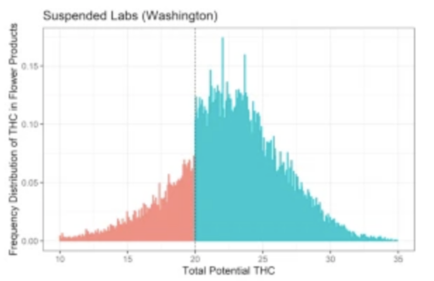

# What is Statistics? {}

Our first unit will cover:

- How and why we will be using R in this course.
- A discussion of *What is Statistics*?
- A discussion of the differences between Exploratory versus Confirmatory analysis
- An overview of some of the problems we will develop tools to answer in this course


## Introduction and R

This course is going to use R for the computations. Much of what we do could be computed using Excell or Google Sheets however R has certain advantages over these tools:

- R is a purpose built statistics software. It is designed to do that really well.
- R arguably is the best tool for producing good looking figures suitable for publications. The figures are easy to manipulate and adjust. Most importantly it is really easy to have your figures be consistently formatted, something that is much harder with spreadsheets. 
- R includes a markdown language for creating nice looking notebooks: It can be used as an all in one publication tool to produce a report or paper with statistical analysis. 
- The markdown language includes LaTex for typsetting mathematics: $$ \int_a^b f(x) dx $$
- R is an industry standard tool for doing statistics. 

and most importantly 

- R is open and free. You can download it, and the tools we will use to interact with it **Rstudio** for free. It is also possible to use R in online environments like Cocalc. 
- If you are teaching a statistics class for your high school or college, I highly recommend using R as part of your class. 

### What do you need

To get started:

1. **If you are using a Mac or PC** you should download a copy of RStudio from https://www.rstudio.com/products/rstudio/  the free version is all you will need. This includes a copy of R itself - Rstudio is a tool for interacting with R to make some of our tasks easier.

2. **If you are using a Chromebook, want to use R on a tablet, or just don't want to install it** I have two options for you:
  a. Cocalc provides an online interface that lets you issue R commands. It also includes a markdown language so you will be able to use it to prepare the documents for class. You can reach it here: https://cocalc.com/ you will need to create an account.
  b. The university Apporto virtual machine:  https://unco.apporto.com has R studio installed. You can log in to it from any browser.
  
If at all possible I would recommend 1. as with the software installed locally you will not need to be using your internet connection. However students using 2. in my classes have reported that it works well for them.

### Open Rstudio

To actually start using R, go ahead and open R studio. You can use R directly in the console (lower-left quadrant). Or you can open a notebook. Notebooks allow you to include markdown explanations around blocks of R code. I will show you an example in class. I typically use a notebook for my work, but the console is easier particularly if you are in a exploratory phase. The frame in the upper-right contains an overview of the variables that have been assigned values; and then the frame in the lower-right gives you an view of the files in your working directory, and if you issue plot commands in the console they will display here.

The button on the top-left of the tool bar is for opening new documents, click the triangle next to it and choose "New Notebook" form the menu. RStudio helpfully inserts some information setting up your new notebook. You can adjust it as you wish. You can save the document from the file menu or using the toolbar buttons. RStudio has provided an example of how to put in Markdown language, and how to put in R commands. You execute a section of R commands but putting the cursor inside of it and pressing "Control+Enter" (or on a mac "Command+Enter", if using Cocalc you will need to press "Shift+Enter").  Try it now on the *plot(cars)* command. 

Note that from our textbook you can copy commands to your computers clipboard which you can then paste and run in the console or paste into a notebook to run - you will have to inclose them in the code enviroment to run.

```{r}
plot(cars)
```

### A few words about programming languages

Before we continue with the *Probability and Statistics* I want to just add that learning programming languages is a powerful tool to help your students advance in their thinking about mathematics, one that I worry we do not spend enough time working with students on. At UNC one of my main goals for my tenure as School Director is to incorporate Python and R into the undergraduate mathematics curriculum wherever we can. A key part of learning a programming language, or more accurately, the only thing that has ever worked for me is having a problem I am interested in that needs solving. Statistics for myself, I hope for you by the end of this course, and for your students could be that problem that motivates learning some programming.

Independent of all of that R is a great language to start with for the following reasons:

1. Because R is so focused on statistics and visualizations of data, it is simpler and more compact than a general language.
2. R is human readable - you can usually read a statement outloud and you will know exactly what it is doing.
3. R is free.

If you are interested in more about how to introduce students to R in a statistics class, or Python in an algebra, trigonometry, or calculus class, please let me know. It is a topic I am very interested in.

### A first example

**How many students were in each of your classes this Spring?**
While I am collecting this data you can reflect on this funny musing. I grew up in rural Vermont and one thing I remember learning as a child was that asking a farmer how many cows they had was very rude, equivalent to asking how much money they had. I've always felt a bit strange asking other teachers how many students they have because of this.


```{r}
# for testing use this
students <- round(rnorm(20, 25, 5))

# for class use this
# students <- {} 

students
```

*R Notes*:  lists in R are enclosed in *curly braces* and each member of the list is separated by a *semi-colon* or a space; note I think leaving the space is bad practice and recommend not using that feature. In this case our list is a collection of integers. Lists can more generally be numbers or strings or even lists of lists. 

Comments in commands start with *hash symbols*.

Another syntax note:  R uses both = and <- for assignment though they have slightly different meanings. They both work as you would expect, however <- has some nice positives in the detailed differences and it is worth getting into the habit of using it.

*RStudio Note*: You might notice that the variable we have just created has appeared in the upper-right quadrant of RStudio.

#### Summary Statistics

To get started we can use *summary* to get an overview of what our list of student enrollments look like. Review the meaning of each of these.

```{r}
summary(students)
```

Mean and Median are *measures of center*, while the quartiles are *measures of spread*. One measure of spread missing is the variance or its square root standard deviation:

```{r}
var(students); sqrt(var(students))
```

The variance is computed by taking the sum of the square differences between the data and the mean and then dividing that by number of items minus one; we will explain why this is what we divide by later in class: 
$$ S = \frac{1}{n-1} \sum_{j=1}^n (y_j - \bar{y} )^2 $$ where $\bar{y}$ is the mean of the sample made up of the $\{ y_1, y_2, \dots, y_n \}$.

In the code blocks below I will add some comments about what we are doing:

```{r}
# define a variable for the mean we will consistently use bar for sample mean
# again note I use the <- assignment rather than =
ybar <- mean(students)

# R can then do the arithmetic and when we combine a list of numbers with a single number and square it, it knows what we mean.
(students - ybar)^2
```

```{r}
# Then as we said, we sum over all of these and then divide by the number of them
# minus 1

sum( (students - ybar)^2 ) / ( length(students) - 1 )
```

Note why we compute variance in this way. We are trying to understand how far the data moves from the mean $\bar{y}$. However we can't just sum over the differences as that will just add up to zero:

```{r}
sum(students - ybar )
```

We have choices though, we could sum over the absolute value and indeed that does give us a notion of spread. However the advantage of summing over the squares is that it brings in tools from Calculus that work with quadratic expressions but not with absolute value expressions. We then intend to take an average. For reasons we will justify later, it turns out the correct average to do is to divide by the size of our sample minus 1:  $n-1$ is called the degrees of freedom (roughly computing $\bar{y}$ from the sample has used up one degree of freedom).

Note the units on these two statistics:  the variance is the average of the sum of the squares (by the number of degrees of freedom) so its units are the square of the units of our sample data (*students squared* in this case); and then the standard deviation is the square root of the variance and so has units of the original data (*students* in this case).


## Plots

That's all fine and good, but a picture (or two) is worth a thousand words and probably tens of thousands of computations. Let's introduce ourselves to two types of plots:

### Histograms

Histograms are made by binning the data and then drawing bars whose height is the number of data points in each bin. They give us a visualization of the distribution of our data:  Taller bars mean more of the data was near those values.

```{r} 
hist(students, 10)
```

Note you can adjust the number of bins to use. R tries to guess the labels from the names of the data. You can output the image to a file by right clicking on it, by using the export command in the plot tab in the lower-right quadrant of RStudio or by using a command in the console in the lower-left quadrant. Of course if you are using Markdown to compose your text you don't need to export the figure, you have it right here.

Note the connection to the numerical summaries we have:  The mean gives the center of mass of the histogram, while the variance (or standard deviation describes how much it spreads out from there).

### BoxPlot

Boxplots are a visual representation of the quartile and median statistics for our data:

```{r}
boxplot(students, horizontal=TRUE)
# Note the use of = for a parameter instead of <-
```

To interpret boxplots you should think in terms of quartiles:  Half of the data is in the box. Half of the data is to either side of the median.

## Categorical Data Example

The class sizes data is an example of *quantitative data* where the information is a numerical quantity that is a feature of the subject. Another type of data used frequently is *categorical data*, data that gives a description of a feature of the subject. We may sometimes represent categorical data with numbers - for example *Male* and *Female* in a data set might be represented with a 0 and a 1; however it would still be categorical describing a feature. 

There are different types of categorical data depending on the feature:  the categories may have an ordering or not; if they have an ordering there may even be a notion of distance between them. It is important to think about what the descriptions for our category mean - If the categories do not have a natural order, or if there is no notion of distance between them, it might be misleading to represent them as numbers and then do computations with the numbers.

### Grades

The example as teachers you should ponder are grades. What does A, B, C, D, F in a Math, English, History, and Physical Educaiton class mean?  Is it valid to replace them with numbers for all of a students classes and compute Grade Point Averages from them? Is it ethical to report that number on a transcript and use it in hiring and admissions decisions?

### Example of Categorical Data

Note if you are running this code, you will need to download the "Supermarket Transactions.xlsx" file from Github or here. We will also need to use the tidy package. You may need to install this package using *install.packages("tidyverse")*. Credit to UC Business Analytics R Programming Guide for this section, you can find the source here https://uc-r.github.io/descriptives_categorical

Then you will need to load the libraries:

```{r}
library(readxl) # for reading Excel files
library(ggplot2) # for making nice plots - part of the tidyverse
```


```{r}
supermarket <- read_excel("Supermarket Transactions.xlsx", sheet = 2)
supermarket
```

A couple of notes are in order here before we continue: Note that this data set is made up of samples (rows) each of which has 10 features (columns). Some of the features are numerical - *Units Sold* and *Revenue*, while others are purely categorical giving us just a description of the value. Also note there is a factor that looks numerical but for which it would probably be misleading to treat it as such. Note that some of the categorical variables have a natural order in the categories like *Annual Income* while others will not such as *State or Province*.

You will notice the note that the data set has ~14,049 rows: We can only deal with such datasets using a computer program. Without too much work we could find datasets that are too big for Excell and need to be analyzed using a software like R or Python - one reason we teach our students how to use them in their undergraduate courses.

### List of features

With a large data set it is helpful to list the features we have:

```{r}
colnames(supermarket)
```

We can use *sapply* to get information about the datatypes R has guessed for each column.

```{r}
sapply(supermarket, class)
```

Note I say that these are guesses. Depending on the spreadsheet the data came from these may or may not be correct. In particular it is not uncommon for numerical data to be incorrectly typed as *character* data. R is efficient at cleaning data, however it is a step further than we want to go in this class, just be aware if you or your students start using data sets from the web you will often come upon this issue.

### Frequencies

We are going to make a contingency table for some of the features of this data. We can count how many members of the sample are in each category of a feature:

```{r}
table(supermarket$Gender)
```

Maybe we want to understand the relationship between the gender of a shopper and their marital status, for this we use a cross classification count:

```{r}
# Note that because the feature Marital Status has a space in it, we have to use quotes to refer to it:
table( supermarket$`Marital Status`, supermarket$Gender) 
```

We can even do multi dimensional tables, though there is a limit to what makes sense. Can you interpret what the 190 in the upper left of this table means?

```{r}
# Here to make this easier to read we are going to do the operation in two separate commands; 
# note the semi-colon indicating the end of the first command
table1 <- table(supermarket$`Marital Status`, supermarket$Gender, supermarket$`State or Province`);

ftable(table1)
```

### Proportions

Of course it is useful to think in terms of proportions of the data rather than the raw counts. We can do this by sending the result of a table command through the prop.table. Try it with one of the tables above:

```{r}
table2 <- table(supermarket$`Marital Status`, supermarket$Gender);

prop.table(table2)
```

Note that we break the procedure into two steps - one making the table and then one producing the proportions with the prop.table() function. The syntax item is in a notebook we need the semicolon. In the console you would just do the first line and then the second line as two separate commands.

### Charts

Visualizations are straightforward, a typical one would be a bar chart indicating visually the frequency counts:

```{r}
# Note in this one the direction of the quotes matter
ggplot(supermarket) + 
  geom_bar(mapping = aes(x=`State or Province`)) + 
  theme(axis.text.x=element_text(angle=45, hjust=1))
```

Note that the labels, colors, and positions can all be set via commands. **ggplot** commands always have this structure, one command setting the dataframe to use, one command identifying what to draw, and then commands to change the theme. Using the same theme command for all of your plots in a project means they will all have identical formatting. R is built to make these figures look very nice and there are more options than we will go over - you can explore them with google if you like.


## Exploratory versus Confirmatory Analysis

We will spend time in this class doing two types of activity with data. *Exploratory Analysis* involves looking at a dataset trying to find patterns and relationships through the different features and combinations of those features. The goal in exploration is to develop hypothesis about the population the data is a sample of. *Confirmatory Analysis* seeks to use data to either confirm or deny a hypothesis - the primary question being asked is *Do we have sufficient evidence to support or reject this hypothesis?* The major difference is that confirmatory analysis rests upon mathematical models of the situation and then tests the sample against that model. The key factor is how frequently you use a member of the sample. You can use it once to test a hypothesis; but if you return to it again you are now doing an exploration. 

A big change in the field in the last two decades is that large datasets are becoming very common. With a large data set exploratory analysis can be very fruitful and provided you keep a portion of your data sequestered could even be combined with a confirmatory analysis.

## Correlations and Predictions

One of our frequent tasks is to use data to make predictions. The process usually involves exploratory analysis of a data set looking for potential relationships between factors in the sample, and then building models to reproduce features of those relationships. Let's explore this with the mpg data set, a sample of features for 234 cars. 

```{r}
mpg
```

*displ* for *displacement* is the total liters the car's engine has in its cylinders, while *hwy* is the *highway miles-per-gallon* efficiency of the vehicle. A basic question is what is the relationship between displacement of the engine and the fuel efficiency. Let's plot for each engine its fuel efficiency versus the engine displacement. Note that the pattern for producing the graph is similar to the one we used above. 

```{r}
ggplot(data = mpg) + geom_point(mapping = aes( x = displ, y = hwy ))
```

Not surprisingly, larger engines are less effecient *generally*. However the relationship is not exact - why not?  

Our model for this is going to be that the *displacement* is known exactly and then the fuel efficiency is given by:  $$ y - y_0 = k (x - x_0) + \mbox{Error} $$ 
Where the Error is a random variable encapsulating all of the other features (variables) in the car - its *mass*, *aerodynmaic features*, *turbo chargers*, *cargo capacity*, *transmission*, and on and on. It is likely we may never even know all of the variables that have an effect on the fuel efficiency and cause two cars with the same displacement to have different efficiencies and hence the reasonableness of thinking of this as some kind of randomness. 

Another possibility is that the relationship is not in fact linear. 

Finally. There may be a subclass of the data that does not fit with the rest. Note the set of six cars with significant displacements (greater than 5 liters) but with fuel efficiencies well 
above the linear trend. To explore this, we can add more variables to a scatter plot by using *color*, *shape*, and *size* attributes. Lets use color with the *class* variable in our data:

```{r}
ggplot(data = mpg) + geom_point(mapping = aes( x = displ, y = hwy, color = class ))
```

And indeed we can now make a hypothesis about what is happening with five of those six vehicles. If we remove them from the problems set we would expect our linear model to do even better (by which we mean the Error terms should be smaller and more controllable). 

## Motivating Questions

I want to end this first lesson with some motivating questions we will be spending our time on this semester. These are questions for which we do not yet have tools to answer but trying to answer them is going to lead us in the technology and tools we build. 

### Engine Failure

An aircraft engine has a 0.1% chance of failing in any given flight-hour of operation. How many flight hours do we expect it to run before its first failure?

### Engine Failure 2

We are testing a new aircraft engine so we run four of them continuously until they fail. They last 220, 300, 320, and 350 hours. How many flight-hours do we expect one of these engines to run?

### Many Engines Failure

An airline is running 655 single enginer aircraft in an hour with the engine used above. How many engine failures do we expect to happen in that hour?

### Duplicate Birthdays

You enter your classroom on the first day of the fall to a group of 25 students. How likely is it that two of them share the same birthday (day / month)?

### Birthday Tickets

You stand at the door to an auditorium and as students enter they hand you a ticket with their birthday (day/month). How many students do you expect to have entered before you have your first duplicate?

### Accidents

An intersection in Greeley, near my house, has on average 1.2 traffic accidents a month. The city, in an attempt to improve on the situation makes a change to the timing of the light. In the month following there are 3 accidents. Do we have evidence that the intersection is now less safe?

### Detecting Fraud

A common analysis used in forensic accounting, specifically in an attempt to detect if fraud is being attempting is to analyze the frequency with which each digit 0, 1, 2, ..., 9 appears in the records. In an honest accounting of a companies finances what digits should be the most common?


### Monty Hall

You are on a game show and are presented with three doors, behind one door is a car and behind the other two there are goats. You are asked to choose a door. After you have chosen one the host, Monty Hall (ask your grandparents), opens a second door revealing a goat. He then asks you if you would like to change your selection. What should you do?

### Monty-Hilbert Hall

You are confronted with a countably infinite number of doors, i.e. they are numbered 1, 2, ..., and told that behind one of them is a car and behind the others goats. You are asked to choose a door. After you have chosen one the host, Hilbert, opens all of the other doors but one revealing goats (A LOT of goats). He then asks you if you would like to change your selection. What should you do?

### Radioactive Decay

The number of atoms of a radioactive isotope in a sample that are likely to decay in a small interval of time is proportional to the number of atoms in the sample. Cesium 137, a by product of some nuclear fission reactors, has a half life of 30 years. It decays, emitting a beta particle, into Barium 137 which has a half-life of just 2.6 minutes and decays emitting a gamma particle - this decay path leading quickly to the release of a gamma particle is what makes Cesium 137 such a dangerous contaminant. What proportion of a sample of Cesium 137 released in an accident do we expect to still be present after 50 years?

### Budgets

The School of Mathematical Sciences spends on average $5,800 a year on copies. How much should we budget for copies for next year?

### Cherry Blossoms

The Cherry Trees in Washington DC are a famous gift from the mayor Tokyo in 1914 aimed at improving the cooperation between the US and Japan. Recently they have become possibly evidence of a change in climate around DC. The last few peak blooms (the date at which 70% of the trees in DC are at full bloom) have been on:  March 28, March 20, April 1, April 5, March 25, March 25, April 10, April 10, April 9, March 20, March 29, and March 31. Over the entire historical record peak bloom has on average occured on April 3. From the recent blooms, do we have evidence that the average date of peak bloom has changed?


### Detecting Fraud in THC Labs

This problem comes from the article: https://jcannabisresearch.biomedcentral.com/articles/10.1186/s42238-021-00064-2 about cannabis testing labs in Washington state. There have been some high profile cases of labs in CA, NV, and CO as well as Canada being fine or suspended for falsifying data or for retailers or producers shopping for labs.

Something suspicious is happening at some labs in Washington state that test for THC concentrations in consumer sold marajuana. The distribution of concentrations appear to be normal except that there is a discontinuity in the distribution at 20% with a higher density of results just above 20% than just below 20%. Here is the histogram that was found: 



Whereas here is a distribution of test results from the largest lab in the sate:


Suppose that you have a set of results from a lab for concentrations of some samples. How would you go about deciding if they have manipulated the results?  

(If you would rather not think of this as a THC lab question - Volkswagon was caught doing something very similar with the effeciencies measurments of their TDI vehicles a few years ago).

#### Detecting Fraud

I would consider building an entire course around this question alone. 

### How Many Locomotives

A train company numbers its locomotives sequentially 1, 2, 3, .... N  You happen to be standing at a station and you observe locomotive number 65 go by. How many locomotives does the company own?

#### The German Tank Problem

This is a baby example of the German Tank Problem from World War 2:  The allies were collecting maintenance records and recovering damaged tanks which included serial numbers on engines and transmissions. From this data they attempted to estimate how many tanks were being produced in Germany. 

### Combining Rare Events with Common Events

At the scene of a crime the two perpetrators left two samples of blood. One was blood type O, occurring in 60% of the population; while the other was blood type AB occurring in only 3% of the population. A suspect, Oliver has his blood tested and it returns as blood type O. Does this indicate evidence in favor of Oliver committing the crime?

Consider this related problem:
Your partner draws two cards from a standard 52 card deck and tells you that one is a red face card, and the other is a number card. How likely is it that the 3 of clubs was the number card drawn?


### Median House Prices

Redfin is reporting that the median price of a house in Denver over the last year is $540,000. To what extent is there evidence that something has changed in the Denver real estate market? What are our predictions about future prices?

### Healthcare Costs

Healthcare costs in the US are made up of three broad categories: Hospitals, Physicians and Clinics, and Prescription Drugs. How are these three costs contributing to the healthcare expenses in the US. What are our predictions about future costs? 

### What Questions Do You Have?

Because this is a course about data, we can look for data related to questions you have. Places I look for data:

- kaggle.com
- [Colorado Data](https://data.colorado.gov/)
- [USA Data](https://www.data.gov/)
- [United Nations Data](http://data.un.org/)
- [Pew Charitable Trust](https://www.pewtrusts.org/en)
- [The University of California at Irvine Data Science Archives](https://archive.ics.uci.edu/ml/datasets.php)


