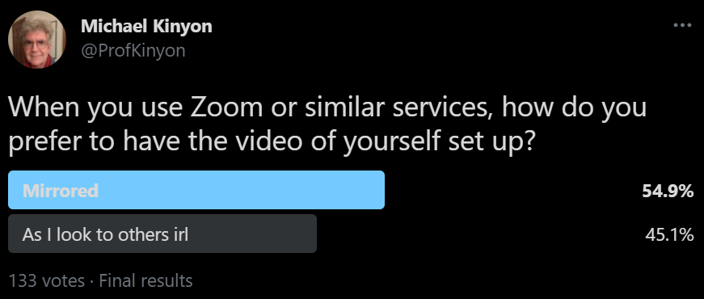

# (APPENDIX) Appendix {-}

# Class Schedule and Activities

**Monday; June 14 -** Introduction, using R, and the Binomial Distribution: Number of Students in our class?  Mirror or non-mirror video for Zoom?

\

**Tuesday; June 15 -** Geometric and Poisson Distributions. Traffic Cameras:  How many pickup trucks versus cars? How many cars per minute?

**Wednesday; June 16 -** Moments and moment generating functions; Continuous distributions.

**Thursday; June 17 -** Uniform, Normal, Gamma, and Beta Distributions: Odometer Readings? Gas Prices? Radioactive Decay? Where will a pedestrian cross a road?

